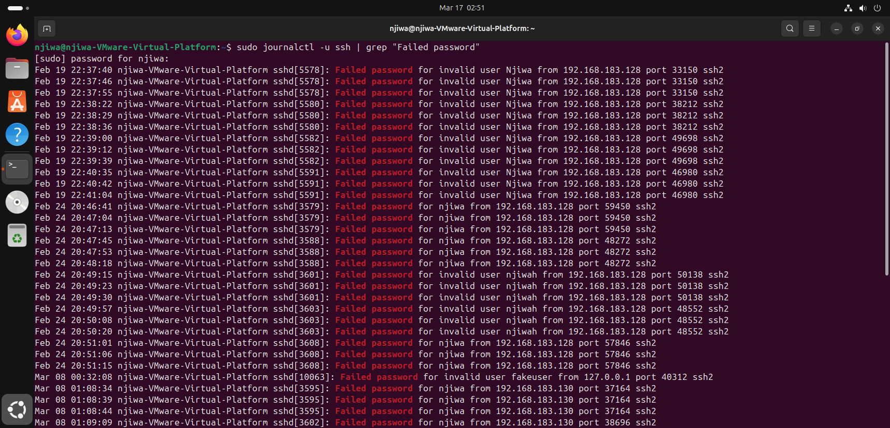
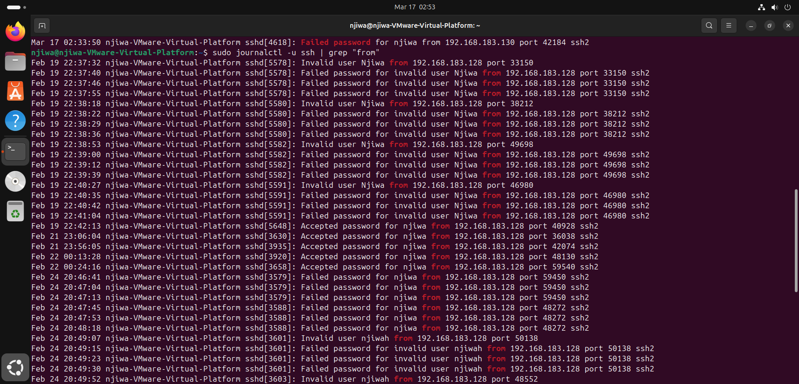
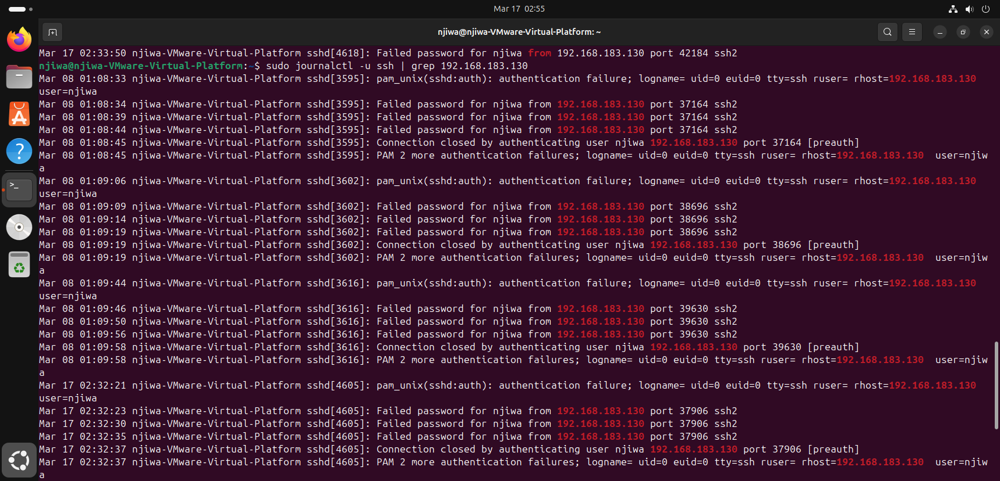
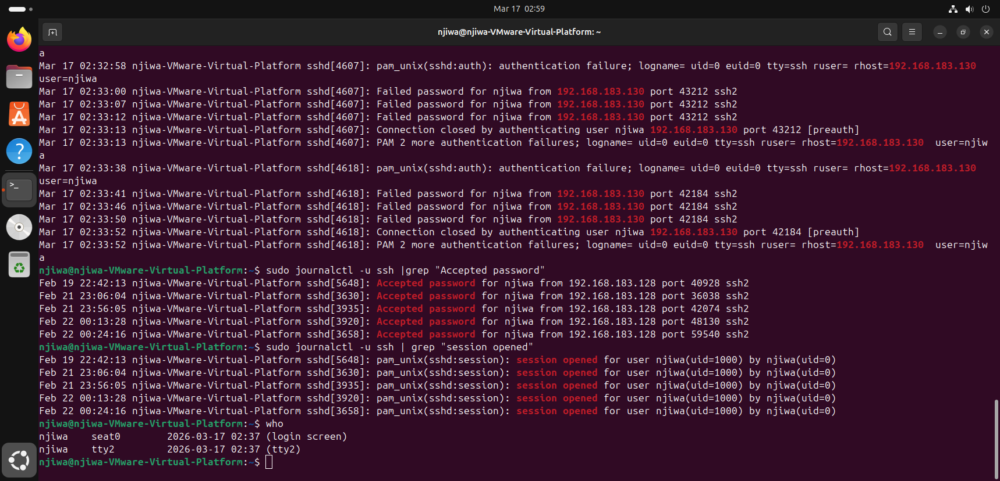
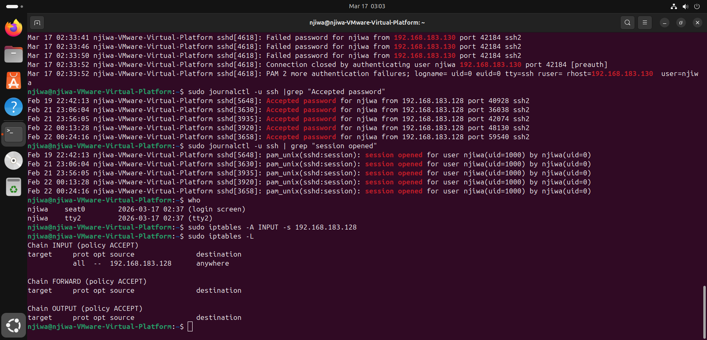
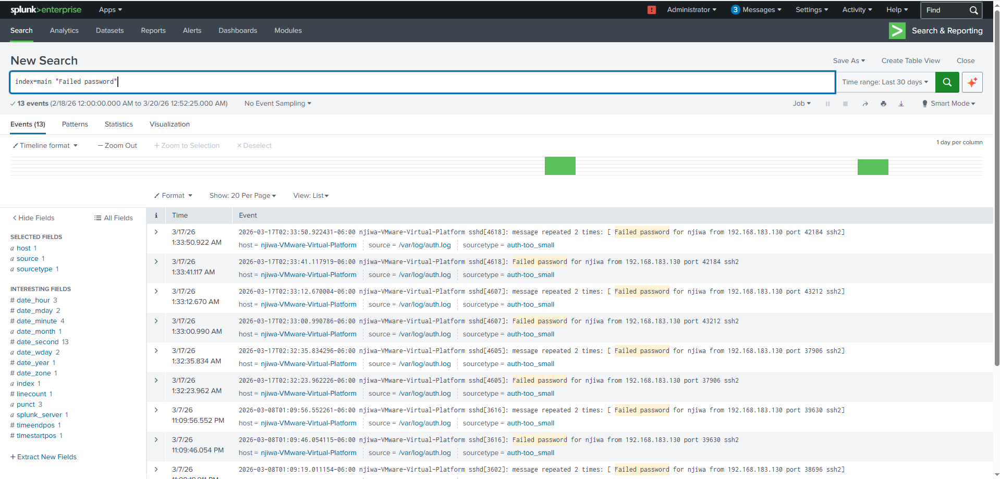
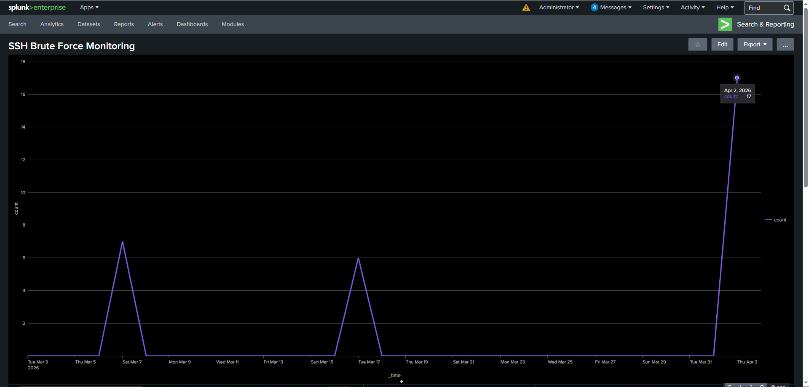
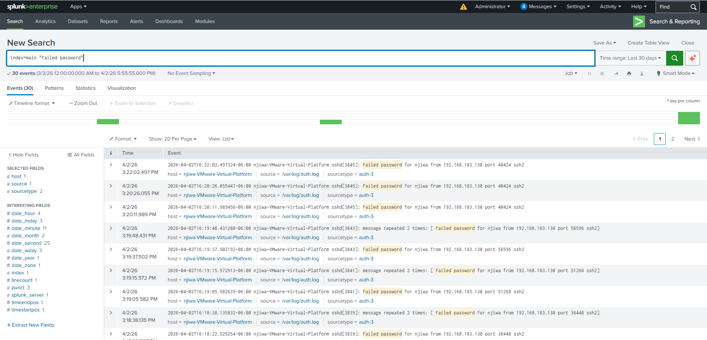
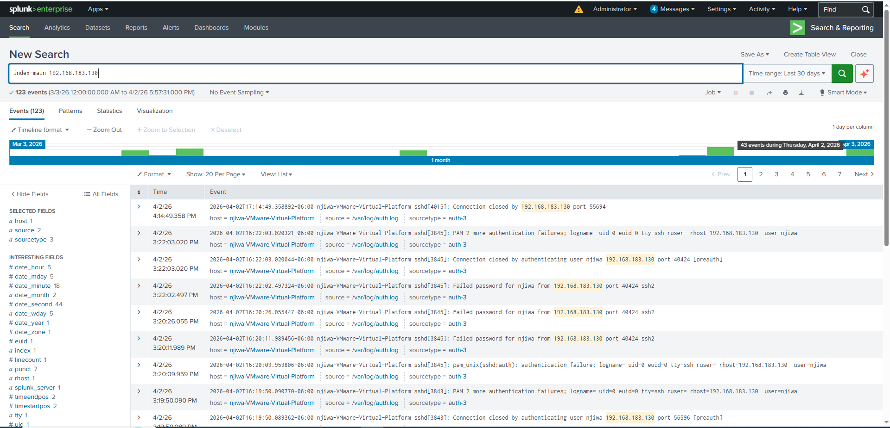

# SSH Brute Force Detection Lab

# Objective

Detect and analyze SSH brute force login attempts using Linux logs and Splunk.

# Tools Used
* Ubuntu (VMware)
* Splunk Enterprise
* Linux CLI (journalctl, grep)
* iptables (firewall)

# Scenario
Multiple failed SSH login attempts were detected on a Linux system. An investigation was performed to identify attacker behavior and validate the threat.

# Investigation Steps
# 1. Detect Failed Logins
sudo journalctl -u ssh | grep "Failed password"
* Multiple failed login attempts observed
* Target user: `njiwa`

# 2. Identify Suspicious IP
sudo journalctl -u ssh | grep "from"
* Suspicious IP identified: `192.168.183.130`

# 3. Verify in Splunk
Search query:
index=main "Failed password"
* Logs confirm repeated failed attempts
* Pattern indicates brute force activity

# 4. Check Successful Logins
sudo journalctl -u ssh | grep "Accepted password"
* Used to determine if attacker gained access
* 
# 5. Filter Logs by Attacker IP
sudo journalctl -u ssh | grep 192.168.183.130
* Confirms repeated activity from the same source
  
# 6. Incident Response (Simulation)
Command prepared to block attacker IP:
sudo iptables -A INPUT -s 192.168.183.130 -j DROP
# Note:
In this lab environment, the IP was not actually blocked because it was used for testing purposes. The command demonstrates how mitigation would be applied in a real scenario.

# Findings
* Repeated failed login attempts detected
* Single IP responsible
* Behavior consistent with SSH brute force attack

# Recommendations
* Enable Fail2Ban to automatically block attackers
* Disable password authentication (use SSH keys)
* Limit login attempts
* Continuously monitor logs

# Evidence

### Failed Login Attempts

### Source IP Identification

### Attacker IP Analysis

### Successful Login Detection

### Firewall Attempt

### Splunk Logs

# Splunk Investigation

This section shows how failed SSH login attempts were analyzed in Splunk to identify brute force activity and the source IP behind it.
 
 ## Analysis
- Multiple failed login attempts observed over time
- Activity originates from IP: 192.168.183.130
- Pattern indicates automated brute force attack

## Visualization

# Splunk Investigation

# Attacker IP Investigation

